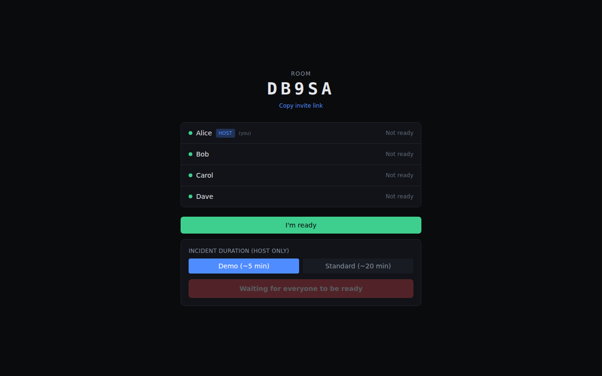
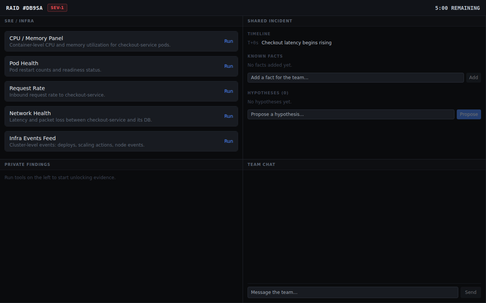
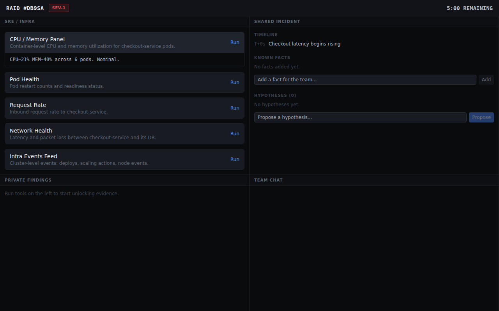
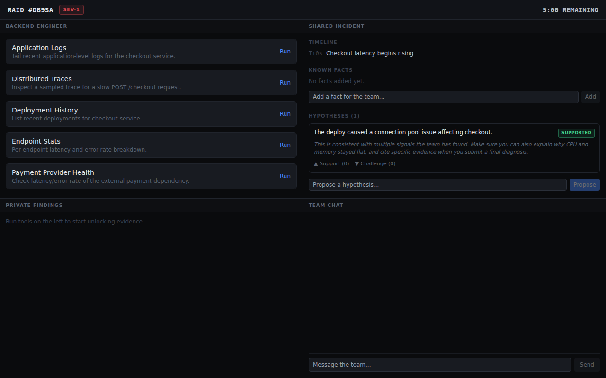
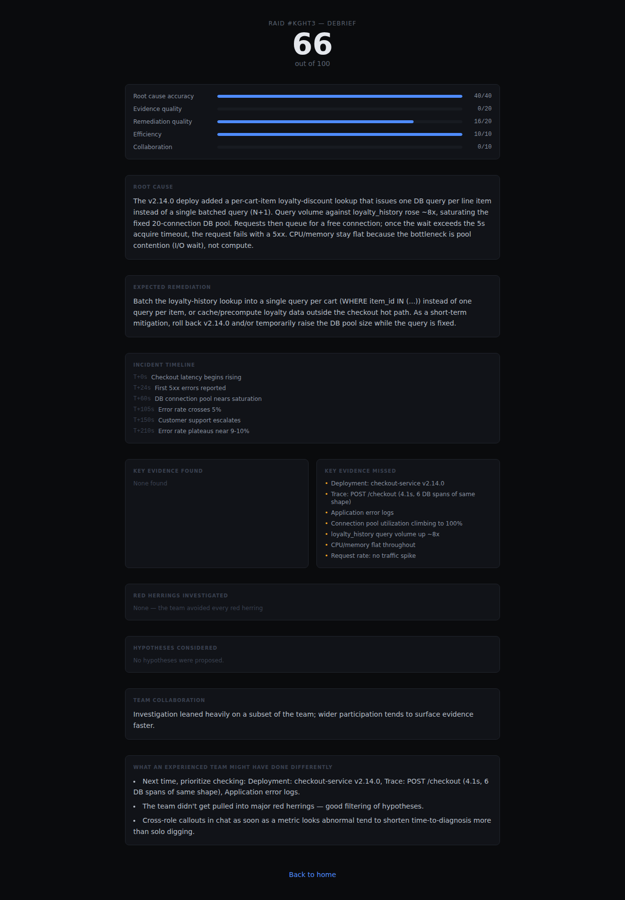
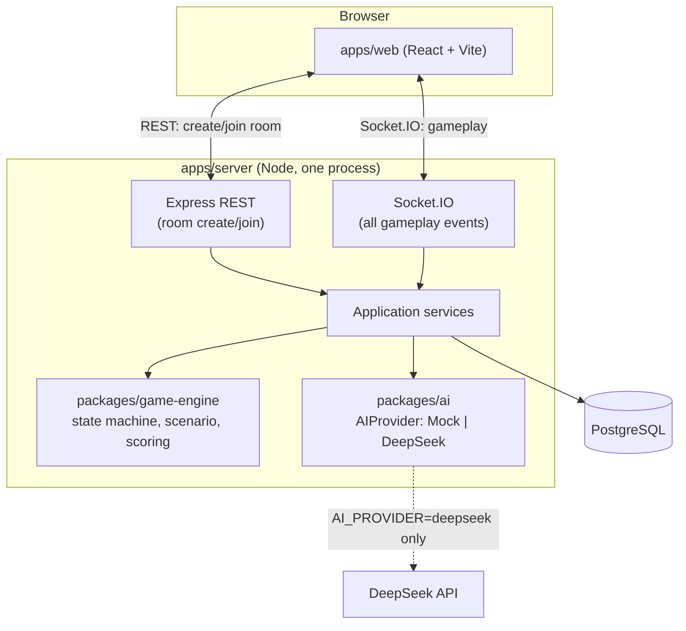

# RAID

RAID is a real-time multiplayer AI incident-response simulator where engineers with asymmetric information collaborate to diagnose production failures before time runs out.

## Why RAID

- **Asymmetric information** — each player sees a different role's logs, metrics, and tools; no single player ever has enough evidence to solve the incident alone.
- **Collaborative debugging under pressure** — a server-authoritative clock and evidence that unlocks over time force the team to communicate, not just individually click through a checklist.
- **AI that reasons about the team, not one player** — DeepSeek evaluates hypotheses and the final diagnosis against what the *group* has collectively surfaced, and an adaptive Game Master watches for a stuck or fixated team and nudges (never solves) from a bounded, structured read of the team's state — never a single private chat transcript.
- **Realistic engineering incidents** — 3 shipping scenarios (N+1 query → connection-pool saturation; a long-held lock blocking writes; an unbounded in-process cache → OOM-kill crash loop), each the kind of postmortem a real backend/SRE team would recognize, not a puzzle-box abstraction.
- **Server-authoritative multiplayer** — every mutation is re-validated against the database on every request; clients propose, the server decides.

## Demo

| Lobby | Active incident |
|---|---|
|  |  |

| Role-specific tools | Shared hypotheses |
|---|---|
|  |  |

| Debrief |
|---|
|  |

All screenshots are real captures from the running application (Playwright driving four separate real browser sessions through an actual game), not mockups.

## How it works

```
1. Create a room
2. 3-4 players join
3. Each gets a different role and private evidence
4. Players investigate using simulated production tools
5. The team combines evidence and hypotheses
6. AI evaluates collective reasoning
7. Team submits diagnosis + remediation
8. RAID produces a scored debrief
```

## Architecture



Full diagrams (lifecycle, hypothesis sequence, AI request flow, ER diagram, deployment, scaling, reconnect): [`docs/ARCHITECTURE.md`](docs/ARCHITECTURE.md).

## Technical highlights

- Server-authoritative multiplayer — the client never asserts state the server trusts blindly
- Typed Socket.IO events — one Zod schema per event, shared unmodified between server and client
- Role-scoped evidence — enforced at the authorization layer, not just hidden in the UI
- Explicit game state machine — a single legal-transition table is the only authority on phase
- Concurrency-safe transitions — optimistic-concurrency versioning + unique constraints resolve real races (host double-start, simultaneous final submission), verified with actual simultaneous socket calls
- Deterministic simulation — evidence unlock timing and scoring are pure functions, not model output
- Append-only event log for audit/debrief, explicitly not claimed as event sourcing
- Structured LLM output validation — schema + semantic checks + repair-prompt retry + graceful fallback
- Reconnect / session restoration — an httpOnly cookie session; reconnect reuses the exact first-load code path
- Real browser multiplayer verification — Playwright driving multiple genuinely separate sessions through the full game loop

## Tech stack

Node.js + TypeScript monorepo (pnpm workspaces) · Express + Socket.IO · PostgreSQL + Drizzle ORM · Zod · React + Vite + Tailwind · DeepSeek (OpenAI-compatible API) · Vitest · Playwright

## Run locally

```bash
pnpm install
docker compose -f docker/docker-compose.yml up -d db   # local Postgres
pnpm db:migrate                                          # from apps/server
pnpm dev                                                  # builds packages, runs web (5173) + server (4000)
```

**See it work end-to-end without a browser**: `pnpm bots` (from `apps/server`, server must be running) drives 4 real socket connections through the entire game loop.

## AI providers

```bash
AI_PROVIDER=mock       # default - deterministic, zero network calls, zero cost
AI_PROVIDER=deepseek   # real model - requires DEEPSEEK_API_KEY
```

`mock` is the default for local development and is what the entire automated test suite runs against — a fresh clone plays and tests fully with no API key. Set `AI_PROVIDER=deepseek` and `DEEPSEEK_API_KEY` in `apps/server/.env` to use the real model. See [`docs/AI_DESIGN.md`](docs/AI_DESIGN.md).

## Testing

```bash
cd packages/game-engine && pnpm exec vitest run   # domain logic: state machine, scoring, scenario rules
cd packages/ai && pnpm exec vitest run            # AI provider: mock behavior, validation, malformed-output handling
cd apps/server && NODE_ENV=test pnpm exec vitest run   # REST + real-socket integration, concurrency races, security/privacy
```

Test categories: unit (pure domain logic), integration (real Postgres + real Socket.IO), concurrency (real simultaneous requests racing for a resource), security (role escalation, evidence-guessing, forged actions), plus a standalone bot-simulation script and scripted multi-session browser verification. See [`docs/TESTING.md`](docs/TESTING.md) for exact coverage — a hardcoded test count would just go stale.

## Repository structure

```
apps/server        Express + Socket.IO backend
apps/web            React + Vite frontend
packages/shared     Types + Zod event contracts
packages/game-engine  State machine, scenarios, scoring (pure, no I/O)
packages/ai         AIProvider: Mock + DeepSeek implementations
docs/                Architecture, decisions, design, protocol, testing, evaluation
docker/              Local Postgres + production Dockerfiles
```

## Documentation

| Doc | Contents |
|---|---|
| [`docs/ARCHITECTURE.md`](docs/ARCHITECTURE.md) | System diagrams, domain boundaries, lifecycle/sequence diagrams |
| [`docs/DECISIONS.md`](docs/DECISIONS.md) | ADRs — every major technical choice, with evidence, not just theory |
| [`docs/GAME_DESIGN.md`](docs/GAME_DESIGN.md) | Scenarios, roles, asymmetric information, scenario-quality checklist |
| [`docs/PLAYTESTING.md`](docs/PLAYTESTING.md) | Human playtest rubric and V0.2 role-balance/pacing/asymmetry evaluation |
| [`docs/AI_DESIGN.md`](docs/AI_DESIGN.md) | Why AI, where, the validation loop, cost discipline |
| [`docs/WEBSOCKET_PROTOCOL.md`](docs/WEBSOCKET_PROTOCOL.md) | Every event, payload, auth rule, broadcast scope |
| [`docs/DATABASE.md`](docs/DATABASE.md) | ER diagram, JSONB usage, concurrency constraints |
| [`docs/DEPLOYMENT.md`](docs/DEPLOYMENT.md) | MVP topology, scaling path |
| [`docs/TESTING.md`](docs/TESTING.md) | Exact commands, coverage, known gaps |
| [`docs/EVALUATION.md`](docs/EVALUATION.md) | Scored self-assessment with evidence for and against |
| [`docs/REVIEW_NOTES.md`](docs/REVIEW_NOTES.md) | Real bugs found in self/adversarial review, and what changed |
| [`docs/MILESTONES.md`](docs/MILESTONES.md) | Per-version acceptance conditions, tests, and results |

## Roadmap

```
V0.1 — Core multiplayer incident simulator    [shipped]
V0.2 — Playability + role balance             [shipped]
V0.3 — Scenario expansion + replayability      [shipped]
V0.4 — Adaptive multiplayer AI                [shipped]
V0.5 — AI-assisted scenario generation
V0.6 — Social + replay layer
```

Current status and per-version acceptance results: [`docs/MILESTONES.md`](docs/MILESTONES.md).

## Known limitations

- No host-kick action for a mid-lobby player (a player can leave voluntarily; a host cannot remove someone else).
- One browser tab holds one identity at a time (a deliberate anonymous-session tradeoff).
- Difficulty (NORMAL/HARD) varies clue legibility and unlock timing, not red-herring count or causal-chain length.
- No horizontal scaling built (single process) — the path is documented, not implemented.
- No automated frontend test suite — covered by server-side integration tests against the same API surface plus scripted multi-session browser testing.
- No CI pipeline — test commands are run by hand.

See [`docs/EVALUATION.md`](docs/EVALUATION.md) for a full scored self-assessment with evidence for and against each score.
