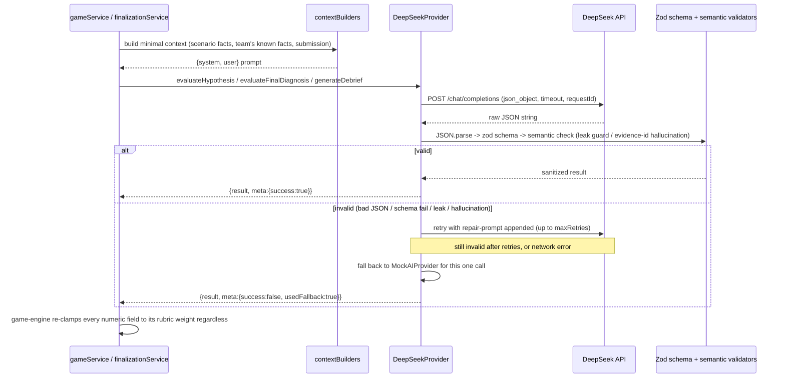

# AI Design

## Why RAID needs AI at all

Splitting the problem in half up front, because conflating "needs language understanding" with
"needs a model" is how projects end up calling an LLM for things a `switch` statement does better:

**Deterministic (no AI, ever):**
rooms, sessions, role assignment, the game-phase state machine, the timer, evidence unlock rules
(tool executed? time threshold passed?), tool authorization by role, scenario progression, chat
persistence, known-fact/hypothesis storage, reaction counting, the `efficiency` and `collaboration`
score components (both are arithmetic over recorded events — see `packages/game-engine/src/scoring.ts`),
persistence, reconnect, socket auth. None of this benefits from a model; all of it needs to be fast,
free, and testable without a network call.

**AI-suitable (five call sites, all behind one interface):**
1. **Hypothesis feedback** — judging whether a free-text hypothesis is supported by the evidence the
   team has surfaced requires actual language understanding of an open-ended sentence against a
   dynamic set of facts. A keyword-matching rule (which `MockAIProvider` uses, deliberately, for
   tests) can approximate this but a real model gives qualitatively better, more specific feedback.
2. **Final-diagnosis grading** (`rootCauseAccuracy`, `evidenceQuality`, `remediationQuality`) — same
   reasoning: judging whether a paragraph of prose correctly identifies a multi-step causal chain
   isn't a pattern match, it's reading comprehension against a rubric.
3. **Debrief coaching notes** — generating *specific*, non-generic coaching ("you found X but not Y,
   here's what to check first next time") from what this particular team actually did requires
   synthesizing several structured facts (evidence found/missed, red herrings chased, hypothesis
   history) into two or three sentences of prose. That's squarely a language-generation task.
4. **Team-state classification** (V0.4) — reading a structured snapshot of what the team has
   collectively surfaced (evidence, hypotheses, coverage, recent activity) and judging *which of 7
   qualitative investigative states* it resembles (fixated on one theory? stalled? contradicting
   itself?) is a synthesis judgment across many structured signals, not a threshold check on any one
   of them.
5. **Intervention proposal** (V0.4) — deciding whether a *specific*, safe, in-fiction nudge would
   genuinely help a team in a classified problem state, phrased naturally, is a generative judgment
   call with hard safety constraints (see "Adaptive Game Master" below) — not a lookup table, because
   the right nudge depends on the specific shape of what the team has and hasn't found.

Everything AI touches is *advisory*: it produces a status label + rationale, or three bounded numbers
+ a rationale, or coaching prose. It never assigns a final score, never sets game phase, never mutates
DB state directly — see "Authoritative state" below.

## Why multiplayer AI, not "AI chat bolted onto multiplayer"

The AI never receives a single player's private context: `buildHypothesisContext` receives the
*team's* known facts (facts players have deliberately promoted from private evidence to the shared
board) and the *team's* other hypotheses, not any one player's raw tool output. `buildFinalEvaluationContext`
receives the team's collective final submission plus which evidence titles they cited. This means the
model is genuinely evaluating team-level reasoning — what got shared, what got argued about, what got
cited — not answering one person's question in isolation. If RAID were "N private AI chats," none of
that cross-role synthesis would exist; the interesting design problem (evaluating whether a *team*,
combining asymmetric information, has actually solved the incident) would collapse into evaluating N
separate transcripts.

## Why not autonomous agents solving the incident

An agent that could read all the evidence and diagnose the incident itself would defeat the product:
the entire premise (section 5/6 of the design brief) is that **humans** must combine asymmetric
information under time pressure — that's the game. An autonomous solver would either need full access
to all roles' evidence (breaking the asymmetric-information design that makes collaboration necessary)
or be scoped to one role (in which case it's just a slower, less fun human). AI's job here is
evaluation and feedback on *human* reasoning, not participation in the investigation.

## Provider abstraction

```ts
interface AIProvider {
  evaluateHypothesis(input): Promise<{ result: HypothesisEvaluation; meta: AIInvocationMeta }>;
  evaluateFinalDiagnosis(input): Promise<{ result: FinalEvaluation; meta: AIInvocationMeta }>;
  generateDebrief(input): Promise<{ result: DebriefContent; meta: AIInvocationMeta }>;
  // V0.4
  classifyTeamState(input): Promise<{ result: TeamStateClassificationResult; meta: AIInvocationMeta }>;
  proposeIntervention(input): Promise<{ result: InterventionProposal; meta: AIInvocationMeta }>;
}
```

Two implementations (`packages/ai`): `MockAIProvider` (deterministic keyword heuristics, zero network
calls — the default for dev and the *only* provider tests run against) and `DeepSeekProvider` (real
API calls). Selected once, at server boot, via `AI_PROVIDER=mock|deepseek`
(`apps/server/src/services/aiService.ts`) — this is the **only** place either class is constructed.
Socket handlers and REST routes never import `@raid/ai` directly; they call `gameService`/
`finalizationService`, which call the shared `aiProvider` singleton. This is what "AI abstraction"
buys concretely: swapping providers, or adding a third one, touches one file.

## DeepSeek integration

- OpenAI-compatible `POST {DEEPSEEK_BASE_URL}/chat/completions`, `model=deepseek-v4-flash`,
  `response_format: {type:"json_object"}`.
- Server-side only — the API key is read from `DEEPSEEK_API_KEY` in `apps/server/src/env.ts` (Zod-
  validated, and the server refuses to boot with `AI_PROVIDER=deepseek` and no key set) and is never
  sent to the client, logged (see `logger.ts` `redact` list), or embedded in any broadcast payload.
- Timeout via `AbortController` (`AI_TIMEOUT_MS`, default 15s), exponential backoff between network-
  error retries (`AI_MAX_RETRIES`, default 2 → 300ms, 600ms), a `requestId` (UUID) attached to every
  call for log correlation.

## AI request lifecycle



## AI response validation loop

Every response goes through the same pipeline (`packages/ai/src/deepseekProvider.ts`):
`JSON.parse` → Zod schema (`packages/ai/src/schemas.ts`, e.g. `rootCauseAccuracy: z.number().min(0).max(40)`)
→ an operation-specific **semantic** validator → accept, or push a repair-prompt message and retry.
Semantic validators exist because a schema alone can't catch a domain violation:

- **Hypothesis evaluation**: `containsRootCauseLeak` (`packages/ai/src/leakGuard.ts`) rejects a
  rationale that states a confirmatory phrase ("that's correct", "the root cause is") or strings
  together multiple distinctive causal-chain terms verbatim. This is intentionally conservative —
  it will occasionally reject a *legitimate* specific rationale that happens to combine two terms the
  team already knows, trading a fallback to generic-but-safe text for never leaking the answer.
- **Final evaluation**: `matchedKeyEvidenceIds` is checked against the scenario's real evidence ids;
  any id the model invented is treated as a validation failure (triggers a repair retry), not silently
  passed through — this is the "hallucinated evidence ID" test case from the spec, and it's exercised
  directly in `packages/ai/src/__tests__/deepseekProvider.test.ts`.

If every attempt fails (`AI_MAX_RETRIES` exhausted, or a persistent network error), the provider falls
back to `MockAIProvider` for that single call rather than throwing — a DeepSeek outage degrades the
quality of feedback for that one hypothesis/evaluation, it never stalls or corrupts an active game.
`meta.usedFallback` is logged so this is observable in production.

## Adaptive Game Master (V0.4)

A second AI capability, layered on top of the hypothesis/final-diagnosis/debrief pipeline above: a
periodic read of the team's collective investigative state, and — only when genuinely warranted — a
single safe, bounded nudge. Four requirements shaped every design decision here: it must never see
raw chat or unbounded state (V0.4.1), it must classify from a fixed enum with structured output only
(V0.4.2), an intervention must be *impossible* to use to leak, mutate, or bypass anything (V0.4.3),
and it must be budget/cooldown-gated and fully deterministic in mock mode (V0.4.4/V0.4.5).

### Collective Reasoning State — bounded by construction, not just by convention

`buildCollectiveReasoningState` (`packages/ai/src/collectiveState.ts`) is a pure function that turns
raw game state into a fixed-shape, capped summary:

| Field | Bound | Source |
|---|---|---|
| `discoveredEvidence` | ≤20 items, **titles + category only, never content** | unlocked evidence ids, team-wide |
| `activeHypotheses` / `challengedHypotheses` / `ruledOutHypotheses` | ≤10 each | hypothesis status + reaction counts |
| `openQuestions` / `knownFacts` | ≤10 / ≤15 | the knowledge board, split by category |
| `toolsExecuted` | tool names, not raw ids | distinct `tool_actions` rows |
| `recentTrajectory` | last 15 events only | `game_events`, filtered to 4 relevant types, oldest entries dropped |
| `subsystemCoverage` | one fraction (0-1) per role | tools-executed-per-role ÷ tools-that-exist-per-role |

This is assembled server-side by `gameService.buildCollectiveStateForGame` — team-wide (every
unlocked evidence item and every hypothesis, not filtered to one player's private view), because the
Game Master reasons about what the *team* has collectively surfaced, exactly the same "team, not
individual" principle as hypothesis/final-diagnosis evaluation above. Two properties fall out of this
design by construction rather than by discipline: prompt size is bounded regardless of how long a
game runs (the caps never grow), and **an intervention can never reference or leak private evidence
content**, because the model is never given evidence content in the first place — only titles.

### Team-State Classification (V0.4.2)

`classifyTeamState` returns exactly one of 7 fixed values, Zod-validated
(`TeamStateClassificationSchema`), with a `confidence` (0-1) and a rationale:

`ON_TRACK` · `TUNNEL_VISION` · `INSUFFICIENT_EVIDENCE` · `CONTRADICTORY_REASONING` ·
`IGNORING_CRITICAL_SIGNAL` · `STALLED` · `SOLVING_TOO_QUICKLY`

`ON_TRACK`, `SOLVING_TOO_QUICKLY`, and `INSUFFICIENT_EVIDENCE` are never intervention-eligible —
the first two describe nothing wrong, and `INSUFFICIENT_EVIDENCE` describes expected early-game
behavior. Only `TUNNEL_VISION`, `CONTRADICTORY_REASONING`, `IGNORING_CRITICAL_SIGNAL`, and `STALLED`
can ever lead to a delivered intervention — `gameMasterService.ts` skips calling `proposeIntervention`
entirely for the other three, saving an AI call (mock or live) that would only ever come back declined.

### Safe Interventions (V0.4.3)

`InterventionProposal` is `{ shouldIntervene, kind, message, targetRole, confidence }`, where `kind`
is one of `CUSTOMER_SYMPTOM` · `TIMING_ADJUSTMENT` · `OPERATIONAL_CLUE` · `RECONCILE_SUGGESTION` ·
`OPTIONAL_HINT` — the *only* things the AI may propose. What it structurally **cannot** do, and why:

| Must never | How this is actually guaranteed |
|---|---|
| Change the root cause / fabricate contradicting facts | An intervention is never merged into scenario or game state — it becomes a read-only chat message and nothing else. There is no code path from a proposal into `games`, `game_evidence`, `hypotheses`, or any scoring table. |
| Reveal the answer | `validateIntervention` (`packages/ai/src/interventionValidator.ts`) runs `containsRootCauseLeak` — the same leak guard hypothesis rationales go through — against the proposed message before it can ever be delivered. |
| Expose private role evidence | The model was never given evidence content (see Collective Reasoning State above) — only titles. `validateIntervention` additionally rejects a message that references a real evidence *or tool* id verbatim, closing off id-smuggling even if attempted. |
| Mutate score | No code path exists from an intervention to any scoring table — see "change the root cause" above. |
| Bypass the game engine | An intervention is delivered exactly the way a scripted timeline event is (`gameService.deliverInterventionChatMessage`, the same `chat_messages` insert `systemChatMessage` uses, just a distinct `kind`) — it goes through no special-cased path. |

This validation is unconditional — it runs on every proposal regardless of provider, including
`MockAIProvider`'s own output, not just DeepSeek's. See `packages/ai/src/__tests__/interventionValidator.test.ts`
and the adversarial "AI intervention attempts root-cause leak" case in
`apps/server/src/__tests__/v0.4.test.ts` (a forced leaking proposal reaches `runGameMasterCheck` and is
discarded before it becomes a chat message or a `game_interventions` row).

### Intervention Budget (V0.4.4)

Hardcoded policy in `gameMasterService.ts` (deliberately not scenario/difficulty-tunable at MVP
scope — a fixed, conservative budget is easier to reason about and test than a parameterized one):

- **Max 3 interventions per game.** Checked against `game_interventions` row count for that game.
- **60-second cooldown** between deliveries, checked against the elapsed-time of the last delivered
  intervention (not wall-clock time — elapsed simulation seconds, so it scales correctly whether the
  game is a 60s bot-simulation run or a 20-minute real one).
- **Minimum confidence 0.5** to actually deliver — a low-confidence proposal that otherwise passed
  validation is discarded rather than shown, on the theory that an unconvincing false nudge is worse
  than staying silent.
- **Durable history**: `game_interventions` (one row per *delivered* intervention only — declined,
  invalid, or under-confidence proposals are never persisted) backs both the budget/cooldown checks
  and is independently queryable from `chat_messages`, which mixes interventions in with player/system
  chat for the UI.

The whole pipeline — `classifyTeamState` → (if eligible) `proposeIntervention` → `validateIntervention`
→ budget/cooldown/confidence gates → persist + deliver — lives in
`apps/server/src/services/gameMasterService.ts`'s `runGameMasterCheck`, called periodically (not every
tick) from the game clock (`sockets/clock.ts`) at an interval scaled to the scenario's duration
(`max(15s, 15% of durationSeconds)`, so a 5-minute demo and a 20-minute standard game both get a
handful of checks rather than one fixed interval being too frequent for one and too sparse for the
other). A classification/AI failure here is caught and logged, never propagated — the adaptive Game
Master is additive on top of the core game loop, never a dependency of it: the timer, evidence
unlocks, and finalization all work identically with it disabled or failing.

### Mock Mode (V0.4.5)

`MockAIProvider.classifyTeamState` is a deterministic priority-ordered ladder over the collective
state's fields (checked in this order: STALLED → INSUFFICIENT_EVIDENCE → CONTRADICTORY_REASONING →
TUNNEL_VISION → IGNORING_CRITICAL_SIGNAL → SOLVING_TOO_QUICKLY → ON_TRACK), and
`proposeIntervention` returns a fixed, kind-appropriate templated message per intervention-eligible
classification (never referencing real evidence/tool ids, so it always passes `validateIntervention`).
Every automated test — `packages/ai/src/__tests__/mockProvider.test.ts`,
`apps/server/src/__tests__/v0.4.test.ts` — runs against this, never a live call; the server test suite
forces specific classifications via `vi.spyOn(aiProvider, ...)` to test the budget/cooldown/validation
orchestration logic directly and deterministically, since the classification heuristic itself is
already exhaustively covered at the `packages/ai` unit level.

### Live API Validation (V0.4.6)

`apps/server/src/scripts/deepseekSmokeTest.ts` (see "Real-network verification status" below) makes
one real `classifyTeamState` and one real `proposeIntervention` call in addition to its existing three
calls — "just enough" live validation per V0.4.6, not a broad live evaluation. Both hit the same
sandbox network restriction documented below; the fallback path itself was verified for real.

## Authoritative state — the AI never gets to skip this

```
PLAYER ACTION → SERVER VALIDATION → DOMAIN/GAME ENGINE → (optional AI call) →
STRUCTURED AI RESPONSE → SCHEMA VALIDATION → DOMAIN VALIDATION → STATE TRANSITION → DB → BROADCAST
```

Concretely: `evaluateHypothesis` returns a status string + rationale — `hypothesesRepo.applyHypothesisEvaluation`
writes it with an optimistic-concurrency check (`version`), so a stale AI response (see below) never
overwrites a hypothesis that moved on in the meantime. `evaluateFinalDiagnosis` returns three numbers
— `assembleFinalScore` (`packages/game-engine/src/scoring.ts`) clamps every one of them to its rubric
weight *again*, independently of the schema-level `.max()`, before summing, and asserts the total
never exceeds 100. The model cannot set `rooms.phase`, cannot unlock evidence, cannot impersonate a
player, cannot bypass the role/visibility checks on `evidence:attach`. It proposes; deterministic code
decides.

### AI response arriving after game phase has changed

A hypothesis evaluation is an in-flight async call while the game clock keeps running. If the
evaluation resolves after the game has moved past `ACTIVE` (or after a *newer* evaluation already
landed), `applyHypothesisEvaluation`'s `WHERE version = <version captured before the AI call started>`
matches zero rows, the write is silently dropped, and `evaluateHypothesisAsync` logs it as a stale
result rather than erroring. No stale AI output ever reaches a client.

## Cost discipline

AI is called once per hypothesis (on creation, not on every support/challenge), once at final
submission, once for the debrief — always exactly three calls for the deterministic hypothesis/
scoring/debrief pipeline, regardless of game length. It is never called for chat, timers, tool
execution, evidence unlocking, or known-fact adds — those are 100% deterministic.

The V0.4 adaptive Game Master adds a periodic `classifyTeamState` call (interval scaled to the
scenario's duration — see "Intervention Budget" above), plus a `proposeIntervention` call only when
the classification is intervention-eligible (4 of the 7 possible classifications) *and* the budget/
cooldown checks haven't already ruled it out — so most classification checks cost exactly one call,
not two. Even in the worst case this is bounded: a 20-minute game gets roughly 6-7 classification
checks total (`~180s` interval), and delivered interventions are hard-capped at 3 per game regardless
of how many checks run.

Every invocation logs `{aiOperation, aiRequestId, aiProvider, aiLatencyMs, aiSuccess, aiUsedFallback}`
(`apps/server/src/services/aiService.ts`) without ever logging the prompt content or the API key, so
per-operation cost/latency/failure-rate is observable without a dedicated dashboard. `MockAIProvider`
is the default and what every automated test runs against — a full CI run costs zero AI credits.

## Real-network verification status

`apps/server/src/scripts/deepseekSmokeTest.ts` makes five real (non-mocked) calls to the live
DeepSeek API — the original three (hypothesis ×2, final diagnosis) plus, as of V0.4, one
`classifyTeamState` and one `proposeIntervention` call. Run in the sandboxed environment this project
was built in (re-confirmed during V0.4, with a real `DEEPSEEK_API_KEY` present in `apps/server/.env`),
all five calls returned a `403 Host not in allowlist: api.deepseek.com` from that environment's
outbound proxy — a network policy restriction of the dev sandbox, not a code defect (confirmed both by
inspecting the proxy's own status endpoint, which lists a fixed egress allowlist that doesn't include
DeepSeek's domain, and by a direct `curl` to `api.deepseek.com` returning the identical CONNECT-tunnel
403). This could not be worked around from inside the session, and no attempt was made to bypass the
proxy (disabling TLS verification or unsetting `HTTPS_PROXY` is out of bounds regardless of the reason).

What this run *did* verify, for real, including the two new V0.4 operations: the fallback path. Every
one of the five calls hit a genuine network failure (not a simulated one via `vi.stubGlobal`) and the
provider correctly caught it, degraded to `MockAIProvider`, and returned a valid, schema-conforming
result with `meta.usedFallback: true` and the real error message logged — exactly the behavior this
document and `docs/DECISIONS.md` claim for a DeepSeek outage, now proven for `classifyTeamState`/
`proposeIntervention` too, not just the original three operations. **Cost: $0.00** — a network-layer
403 never reaches the model and is never billed. What was **not** verified in this environment: real
DeepSeek response quality/latency at the actual model, for any of the five operations. Anyone running
this project with open egress to `api.deepseek.com` can confirm that half with the same script — it
requires no code change, only network access this sandbox didn't have.

## What was NOT built (as of V0.4): scenario generation

`generateScenario` is not part of the call path through V0.4 — all 3 scenarios
(`packages/game-engine/src/scenarios/`) are authored as code so their causal chains, red herrings, and
evidence-to-role mappings could be hand-tuned and validated against the structural checklist in
`docs/GAME_DESIGN.md` before ever being played. `ScenarioSeedSchema` (`packages/ai/src/schemas.ts`)
exists as a documented extension point — the shape a future `generateScenario` call would need to
satisfy — rather than leaving that decision unmade. This is planned for V0.5.
