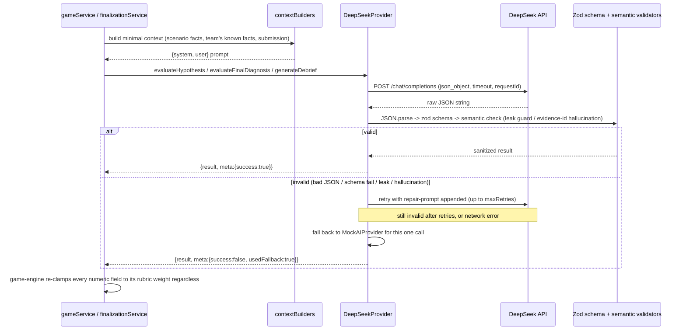

# AI Design

## Why RAID needs AI at all

Splitting the problem in half up front, because conflating "needs language understanding" with
"needs a model" is how projects end up calling an LLM for things a `switch` statement does better:

**Deterministic (no AI, ever):**
rooms, sessions, role assignment, the game-phase state machine, the timer, evidence unlock rules
(tool executed? time threshold passed?), tool authorization by role, scenario progression, chat
persistence, known-fact/hypothesis storage, reaction counting, the `efficiency` and `collaboration`
score components (both are arithmetic over recorded events — see `packages/game-engine/src/scoring.ts`),
persistence, reconnect, socket auth. None of this benefits from a model; all of it needs to be fast,
free, and testable without a network call.

**AI-suitable (three call sites, all behind one interface):**
1. **Hypothesis feedback** — judging whether a free-text hypothesis is supported by the evidence the
   team has surfaced requires actual language understanding of an open-ended sentence against a
   dynamic set of facts. A keyword-matching rule (which `MockAIProvider` uses, deliberately, for
   tests) can approximate this but a real model gives qualitatively better, more specific feedback.
2. **Final-diagnosis grading** (`rootCauseAccuracy`, `evidenceQuality`, `remediationQuality`) — same
   reasoning: judging whether a paragraph of prose correctly identifies a multi-step causal chain
   isn't a pattern match, it's reading comprehension against a rubric.
3. **Debrief coaching notes** — generating *specific*, non-generic coaching ("you found X but not Y,
   here's what to check first next time") from what this particular team actually did requires
   synthesizing several structured facts (evidence found/missed, red herrings chased, hypothesis
   history) into two or three sentences of prose. That's squarely a language-generation task.

Everything AI touches is *advisory*: it produces a status label + rationale, or three bounded numbers
+ a rationale, or coaching prose. It never assigns a final score, never sets game phase, never mutates
DB state directly — see "Authoritative state" below.

## Why multiplayer AI, not "AI chat bolted onto multiplayer"

The AI never receives a single player's private context: `buildHypothesisContext` receives the
*team's* known facts (facts players have deliberately promoted from private evidence to the shared
board) and the *team's* other hypotheses, not any one player's raw tool output. `buildFinalEvaluationContext`
receives the team's collective final submission plus which evidence titles they cited. This means the
model is genuinely evaluating team-level reasoning — what got shared, what got argued about, what got
cited — not answering one person's question in isolation. If RAID were "N private AI chats," none of
that cross-role synthesis would exist; the interesting design problem (evaluating whether a *team*,
combining asymmetric information, has actually solved the incident) would collapse into evaluating N
separate transcripts.

## Why not autonomous agents solving the incident

An agent that could read all the evidence and diagnose the incident itself would defeat the product:
the entire premise (section 5/6 of the design brief) is that **humans** must combine asymmetric
information under time pressure — that's the game. An autonomous solver would either need full access
to all roles' evidence (breaking the asymmetric-information design that makes collaboration necessary)
or be scoped to one role (in which case it's just a slower, less fun human). AI's job here is
evaluation and feedback on *human* reasoning, not participation in the investigation.

## Provider abstraction

```ts
interface AIProvider {
  evaluateHypothesis(input): Promise<{ result: HypothesisEvaluation; meta: AIInvocationMeta }>;
  evaluateFinalDiagnosis(input): Promise<{ result: FinalEvaluation; meta: AIInvocationMeta }>;
  generateDebrief(input): Promise<{ result: DebriefContent; meta: AIInvocationMeta }>;
}
```

Two implementations (`packages/ai`): `MockAIProvider` (deterministic keyword heuristics, zero network
calls — the default for dev and the *only* provider tests run against) and `DeepSeekProvider` (real
API calls). Selected once, at server boot, via `AI_PROVIDER=mock|deepseek`
(`apps/server/src/services/aiService.ts`) — this is the **only** place either class is constructed.
Socket handlers and REST routes never import `@raid/ai` directly; they call `gameService`/
`finalizationService`, which call the shared `aiProvider` singleton. This is what "AI abstraction"
buys concretely: swapping providers, or adding a third one, touches one file.

## DeepSeek integration

- OpenAI-compatible `POST {DEEPSEEK_BASE_URL}/chat/completions`, `model=deepseek-v4-flash`,
  `response_format: {type:"json_object"}`.
- Server-side only — the API key is read from `DEEPSEEK_API_KEY` in `apps/server/src/env.ts` (Zod-
  validated, and the server refuses to boot with `AI_PROVIDER=deepseek` and no key set) and is never
  sent to the client, logged (see `logger.ts` `redact` list), or embedded in any broadcast payload.
- Timeout via `AbortController` (`AI_TIMEOUT_MS`, default 15s), exponential backoff between network-
  error retries (`AI_MAX_RETRIES`, default 2 → 300ms, 600ms), a `requestId` (UUID) attached to every
  call for log correlation.

## AI request lifecycle



## AI response validation loop

Every response goes through the same pipeline (`packages/ai/src/deepseekProvider.ts`):
`JSON.parse` → Zod schema (`packages/ai/src/schemas.ts`, e.g. `rootCauseAccuracy: z.number().min(0).max(40)`)
→ an operation-specific **semantic** validator → accept, or push a repair-prompt message and retry.
Semantic validators exist because a schema alone can't catch a domain violation:

- **Hypothesis evaluation**: `containsRootCauseLeak` (`packages/ai/src/leakGuard.ts`) rejects a
  rationale that states a confirmatory phrase ("that's correct", "the root cause is") or strings
  together multiple distinctive causal-chain terms verbatim. This is intentionally conservative —
  it will occasionally reject a *legitimate* specific rationale that happens to combine two terms the
  team already knows, trading a fallback to generic-but-safe text for never leaking the answer.
- **Final evaluation**: `matchedKeyEvidenceIds` is checked against the scenario's real evidence ids;
  any id the model invented is treated as a validation failure (triggers a repair retry), not silently
  passed through — this is the "hallucinated evidence ID" test case from the spec, and it's exercised
  directly in `packages/ai/src/__tests__/deepseekProvider.test.ts`.

If every attempt fails (`AI_MAX_RETRIES` exhausted, or a persistent network error), the provider falls
back to `MockAIProvider` for that single call rather than throwing — a DeepSeek outage degrades the
quality of feedback for that one hypothesis/evaluation, it never stalls or corrupts an active game.
`meta.usedFallback` is logged so this is observable in production.

## Authoritative state — the AI never gets to skip this

```
PLAYER ACTION → SERVER VALIDATION → DOMAIN/GAME ENGINE → (optional AI call) →
STRUCTURED AI RESPONSE → SCHEMA VALIDATION → DOMAIN VALIDATION → STATE TRANSITION → DB → BROADCAST
```

Concretely: `evaluateHypothesis` returns a status string + rationale — `hypothesesRepo.applyHypothesisEvaluation`
writes it with an optimistic-concurrency check (`version`), so a stale AI response (see below) never
overwrites a hypothesis that moved on in the meantime. `evaluateFinalDiagnosis` returns three numbers
— `assembleFinalScore` (`packages/game-engine/src/scoring.ts`) clamps every one of them to its rubric
weight *again*, independently of the schema-level `.max()`, before summing, and asserts the total
never exceeds 100. The model cannot set `rooms.phase`, cannot unlock evidence, cannot impersonate a
player, cannot bypass the role/visibility checks on `evidence:attach`. It proposes; deterministic code
decides.

### AI response arriving after game phase has changed

A hypothesis evaluation is an in-flight async call while the game clock keeps running. If the
evaluation resolves after the game has moved past `ACTIVE` (or after a *newer* evaluation already
landed), `applyHypothesisEvaluation`'s `WHERE version = <version captured before the AI call started>`
matches zero rows, the write is silently dropped, and `evaluateHypothesisAsync` logs it as a stale
result rather than erroring. No stale AI output ever reaches a client.

## Cost discipline

AI is called exactly three times per meaningful action: once per hypothesis (on creation, not on every
support/challenge), once at final submission, once for the debrief. It is never called for chat,
timers, tool execution, evidence unlocking, or known-fact adds — those are 100% deterministic. Every
invocation logs `{aiOperation, aiRequestId, aiProvider, aiLatencyMs, aiSuccess, aiUsedFallback}`
(`apps/server/src/services/aiService.ts`) without ever logging the prompt content or the API key, so
per-operation cost/latency/failure-rate is observable without a dedicated dashboard. `MockAIProvider`
is the default and what every automated test runs against — a full CI run costs zero AI credits.

## Real-network verification status

`apps/server/src/scripts/deepseekSmokeTest.ts` makes three real (non-mocked) calls to the live
DeepSeek API. Run in the sandboxed environment this project was built in, all three calls returned a
`403 Host not in allowlist: api.deepseek.com` from that environment's outbound proxy — a network
policy restriction of the dev sandbox, not a code defect (confirmed by inspecting the proxy's own
status endpoint, which lists a fixed egress allowlist that doesn't include DeepSeek's domain). This
could not be worked around from inside the session.

What this run *did* verify, for real: the fallback path. Every one of the three calls hit a genuine
network failure (not a simulated one via `vi.stubGlobal`) and the provider correctly caught it,
degraded to `MockAIProvider`, and returned a valid, schema-conforming result with
`meta.usedFallback: true` and the real error message logged — exactly the behavior
`docs/DECISIONS.md`/this document claim for a DeepSeek outage. What was **not** verified this
session: real DeepSeek response quality/latency at the actual model. Anyone running this project with
open egress to `api.deepseek.com` can confirm that half with the same script — it requires no code
change, only network access this sandbox didn't have.

## What was NOT built: scenario generation

`generateScenario` is not part of the MVP call path — the one scenario is authored as code
(`packages/game-engine/src/scenarios/checkoutDegradation.ts`) so its causal chain, red herrings, and
evidence-to-role mapping could be hand-tuned and validated against the structural checklist in
`docs/GAME_DESIGN.md` before ever being played. `ScenarioSeedSchema` (`packages/ai/src/schemas.ts`)
exists as a documented extension point — the shape a future `generateScenario` call would need to
satisfy — rather than leaving that decision unmade.
