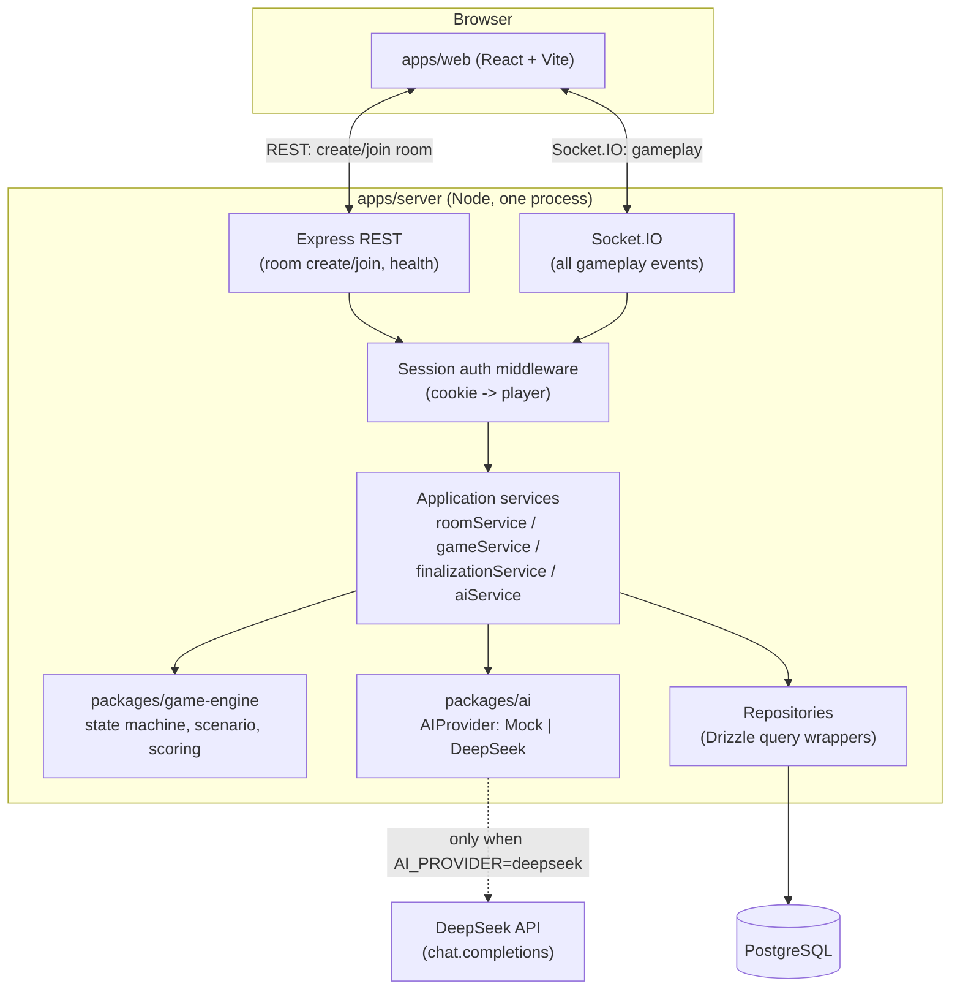
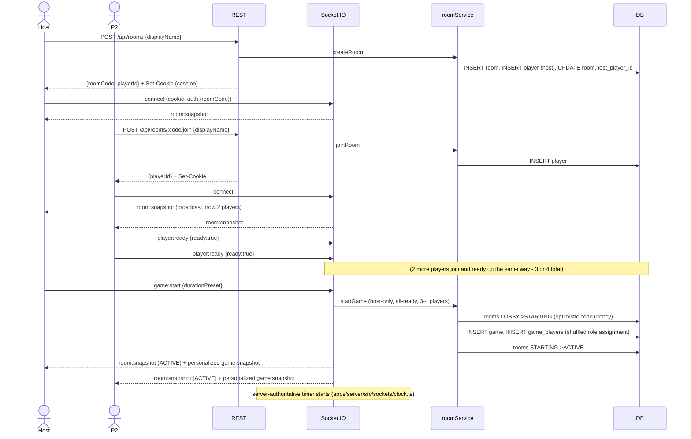
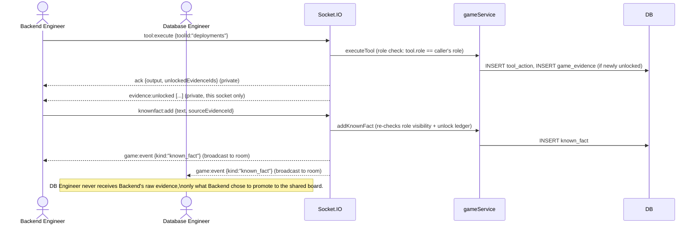
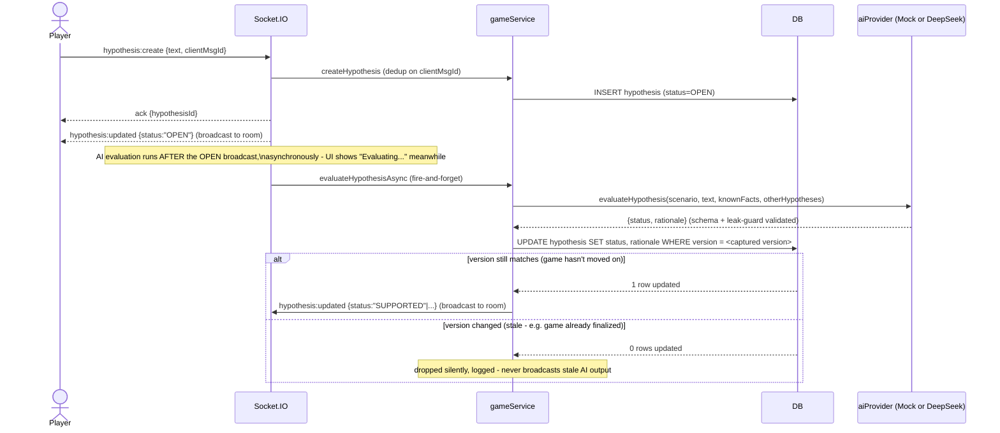
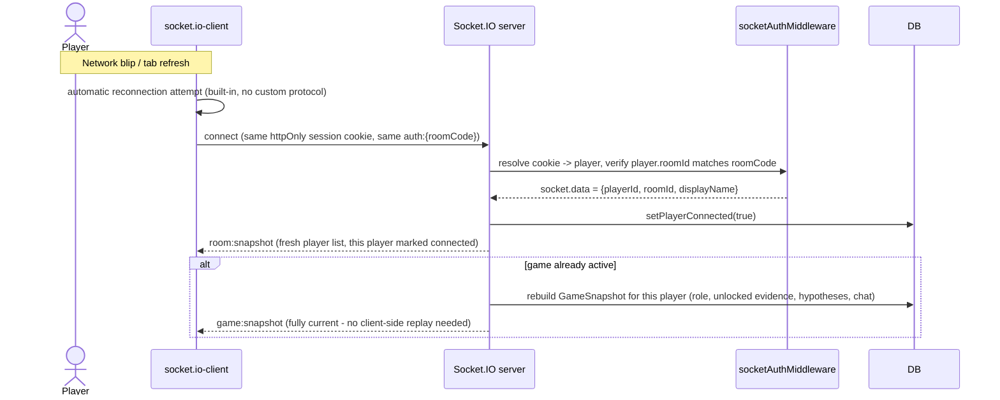

# Architecture

RAID is a modular monolith: one Node process serving REST + WebSockets, one PostgreSQL database, one
static frontend. See `docs/DECISIONS.md` ADR "monolith vs microservices" for why — the short version
is that nothing in this MVP has an independent scaling or deployment need that would justify the
operational cost of splitting it up, and the monorepo's package boundaries (`packages/shared`,
`packages/game-engine`, `packages/ai`) already give the codebase the seams a future extraction would
use, without paying for network calls between them today.

## High-level system architecture



## Domain boundaries

```
Transport (routes/*.ts, sockets/index.ts)
    - Zod-parse the payload, resolve identity from socket.data / session cookie, call a service, ack.
    - No business logic here. A handler that's more than ~10 lines is a smell.
        v
Application services (services/*.ts)
    - roomService: lobby lifecycle, role assignment, the LOBBY->ACTIVE transition
    - gameService: tool execution, hypotheses, evidence, chat, known facts, snapshot assembly
    - finalizationService: the ACTIVE->FINALIZING->COMPLETED transition, scoring, debrief assembly
    - aiService: constructs the one AIProvider singleton; the only file that imports @raid/ai's
      concrete classes
        v
Domain / game engine (packages/game-engine) - pure functions, no I/O
    - stateMachine: legal phase transitions
    - scenarioEngine: evidence unlock predicates, role/tool authorization, tool-result computation
    - scoring: deterministic efficiency/collaboration, rubric clamping
        v
Repositories (repositories/*.ts) - thin Drizzle query wrappers, one file per aggregate
    - No query building outside this layer; services never import `db` and call `.select()` directly
      themselves (aiService/gameService import repo functions, not the schema)
        v
PostgreSQL
```

AI sits *beside* this stack, not inside it: `gameService`/`finalizationService` call `aiProvider.
evaluate*` the same way they call a repository function — an awaited call that returns validated data,
never a callback with side effects. See docs/AI_DESIGN.md for the full request lifecycle.

## Room / game lifecycle



## Multiplayer realtime flow (steady-state investigation)



## Hypothesis submission sequence



## Reconnect flow



Reconnect and first-load are the *same code path* (`handleConnection` in `apps/server/src/sockets/
index.ts` doesn't branch on "is this a reconnect") — see docs/DECISIONS.md ADR-003 for why Socket.IO's
built-in reconnection made this possible without a custom resume protocol, and
`gameFlow.integration.test.ts` for the test that actually disconnects and reconnects a socket mid-game
and asserts role + evidence survive.

## Horizontal scaling path (not built, deliberately)

See docs/DEPLOYMENT.md for the full diagram and sticky-session discussion. In one sentence: today one
process holds all room state in Postgres + in-memory timers; scaling to N processes needs sticky
sessions (a room's sockets must land on the process that owns its timer) or a Socket.IO Redis adapter
for cross-process broadcast — neither is implemented because nothing about the MVP's expected load
(a handful of concurrent 3-4 player rooms) requires it yet, and docs/DECISIONS.md's Redis ADR explains
why adding it now would be solving a problem that doesn't exist.
