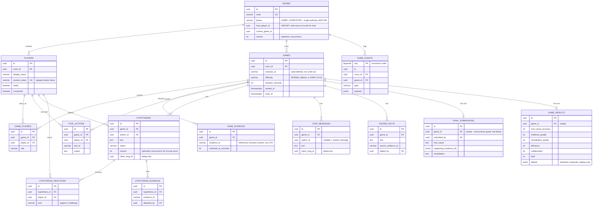

# Database

PostgreSQL, accessed through Drizzle ORM (`apps/server/src/db/schema.ts`). Migrations are generated
with `drizzle-kit` and applied with a plain `drizzle-orm/postgres-js/migrator` script
(`pnpm db:migrate`) — no separate migration runner service.

## Entity-relationship diagram

## Why relational columns vs. JSONB, table by table

The default is a real column with a foreign key and, where the spec calls for it, a uniqueness
constraint — JSONB is used in exactly three places, each for a specific reason:

1. **`game_events.payload`** — an append-only log of ~15 distinct event *types*
   (`PLAYER_JOINED`, `TOOL_EXECUTED`, `HYPOTHESIS_EVALUATED`, ...), each with a different shape.
   Modeling this relationally would mean either one nullable column per possible field across every
   event type (a very wide, mostly-null table) or one child table per event type joined back through
   a polymorphic FK — both add real complexity for data that is only ever read back as "the timeline
   for this game," never queried by a specific payload field. JSONB is the right tool for genuinely
   heterogeneous, read-as-a-blob data.
2. **`final_submissions.supporting_evidence_ids`** — a variable-length list of evidence-id *strings*.
   These ids reference scenario content defined in code (`packages/game-engine`), not database rows —
   there is nothing to foreign-key against, and the list's only consumers are "iterate it" and "check
   membership," which a `jsonb` array serves fine without a join table.
3. **`game_results.debrief`** — the fully rendered `Debrief` object (score breakdown, coaching notes,
   timeline snapshot, evidence titles). This is a display-only composite assembled once at
   finalization time; nothing ever queries into a specific field of a stored debrief, it's read back
   whole for the debrief screen. A join table across half a dozen sub-shapes would add migration
   surface for zero query benefit.

Everything else — room/player/game relationships, role assignments, hypothesis authorship, reaction
identities, evidence-unlock timestamps — is queried by specific fields, needs referential integrity,
or is the exact target of a uniqueness constraint doing real concurrency-control work (see below), so
it's a normal column.

## Concurrency-relevant constraints

These four constraints are not incidental — they are *how* the specific race conditions the spec
calls out are made safe, not just described as safe:

| Constraint | Race it prevents |
|---|---|
| `rooms.version` optimistic concurrency (checked in every `UPDATE ... WHERE phase=? AND version=?`) | host double-clicking Start; the timer and a final submission both trying to move `ACTIVE → FINALIZING` at once |
| `UNIQUE(final_submissions.game_id)` | two players submitting the final diagnosis simultaneously — only one `INSERT` can win |
| `UNIQUE(hypotheses.game_id, client_msg_id)` and `UNIQUE(chat_messages.game_id, client_msg_id)` | duplicate socket messages (retry after a dropped ack) creating duplicate rows |
| `UNIQUE(hypothesis_reactions.hypothesis_id, player_id, kind)` | the same player double-clicking Support; two concurrent Support clicks from one player collapse to one row |
| `UNIQUE(game_evidence.game_id, evidence_id)` via `ON CONFLICT DO NOTHING` | two role-teammates' concurrent tool calls both trying to record the same evidence unlock |

`hypotheses.version` is a second, separate optimistic-concurrency column guarding a different race:
an AI hypothesis evaluation that resolves *after* the game has moved on (see docs/AI_DESIGN.md "AI
response arriving after phase change").

## Event log vs. event sourcing

`game_events` is an **append-only audit log**, not an event-sourced system. The distinction matters:
in true event sourcing, current state (a room's phase, a hypothesis's status, ...) is *reconstructed*
by replaying its event stream — the events are the only source of truth. Here, current state lives in
its own tables (`rooms.phase`, `hypotheses.status`, ...) written directly by services in the same
transaction as the domain action; `game_events` is written alongside as a secondary record for
auditability, debugging, and the debrief timeline. If `game_events` were deleted, the game would keep
working correctly; if `rooms`/`games`/`hypotheses` were deleted, `game_events` alone could not
reconstruct a playable game. Calling this "event sourcing" would overstate what it does — see
docs/DECISIONS.md "why not fully event-source everything" for the tradeoff discussion.
