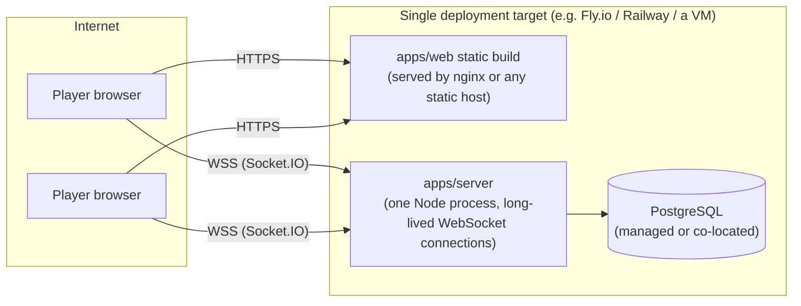
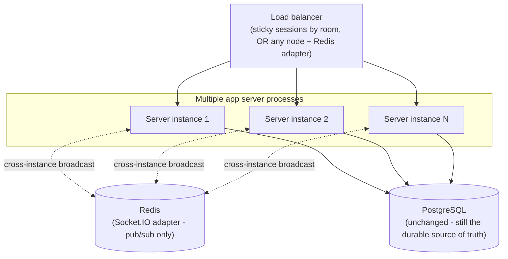

# Deployment

## MVP target

One application process, one database, a static frontend. `docker/Dockerfile.server` and
`docker/Dockerfile.web` build each independently; `docker/docker-compose.yml` runs only Postgres for
local dev (`docker compose -f docker/docker-compose.yml up -d db`), matching the spec's requested
`docker compose up -d db && pnpm install && pnpm db:migrate && pnpm dev` local flow.

**Deployment target must support long-lived WebSocket connections and process affinity for a given
room.** This rules out any platform that treats the backend as a short-lived request/response
function (a plain serverless/Lambda-style deployment) — a RAID game session is a multi-minute-long
open socket, not a request. Fly.io, Railway, Render, a plain VM/container host, or any platform with
persistent container processes and WebSocket passthrough all work; a pure FaaS platform does not,
without additional infrastructure (a separate always-on WebSocket gateway) that the MVP doesn't need.

## Environment variables

Server (`apps/server/.env`, see `.env.example`): `DATABASE_URL`, `PORT`, `CORS_ORIGIN`,
`SESSION_COOKIE_NAME`, `SESSION_TTL_DAYS`, `AI_PROVIDER` (`mock`|`deepseek`), `DEEPSEEK_API_KEY`
(required only if `AI_PROVIDER=deepseek` — the server refuses to boot otherwise, see `env.ts`),
`DEEPSEEK_BASE_URL`, `DEEPSEEK_MODEL`, `AI_TIMEOUT_MS`, `AI_MAX_RETRIES`, `LOG_LEVEL`. Web
(`apps/web/.env`): `VITE_SERVER_URL`. No secret is ever committed — both `.env` files are
gitignored, `.env.example` ships with placeholders only.

## Horizontal scaling path (future, not built)

Two things change from the MVP topology, and only two: (1) the in-memory per-game timer
(`apps/server/src/sockets/clock.ts`) would need to become either sticky-routed to one owning instance
per room or moved to a shared scheduler (e.g. a DB-backed "next tick due" row picked up by whichever
instance polls it) — right now, `resumeActiveClocks` re-adopts any `ACTIVE` room's timer on process
boot, which already handles single-instance restarts but not a fleet; (2) Socket.IO's default
in-process broadcast (`io.to(room).emit(...)`) would need the official Redis adapter so an emit from
instance A reaches a socket connected to instance B. **Nothing about game state itself changes** — 
Postgres was always the durable source of truth, never any in-process memory, so this is purely an
event-fanout and timer-ownership problem, not a data-migration one.

Sticky sessions (routing a room's sockets to the instance that currently owns its timer) are the
simpler of the two options and would likely come first in practice, deferring the Redis adapter until
genuine multi-instance load justified the added moving part.

## Why not deploy this today

Nothing here is built because nothing about the MVP's expected load (a handful of concurrent 3-4
player rooms during development/demo/interview use) approaches single-process capacity. Building the
Redis adapter and sticky-session routing now would be exactly the "premature distributed-systems
cosplay" the design brief explicitly warns against (section 50) — it's documented as a real path with
real diagrams so the extraction is a known quantity if/when load ever requires it, not so it gets
built speculatively.
