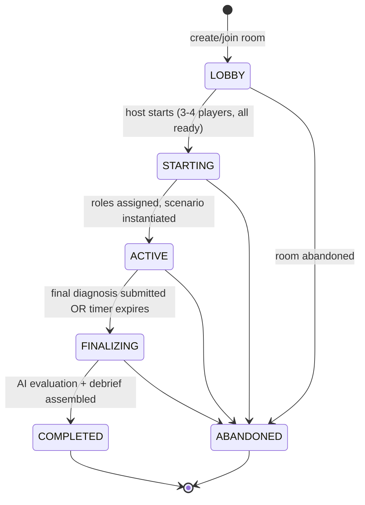

# Game Design

## Pitch

Incident-response war room × escape room × social deduction × debugging simulator. 3-4 players each
see a different slice of one production incident and have a fixed clock to combine what they know
into a correct root cause before time runs out.

## The game loop, step by step

This is `packages/game-engine/src/stateMachine.ts`'s literal transition table — every arrow above is
an entry in `LEGAL_TRANSITIONS`, and every non-arrow (e.g. `ACTIVE → LOBBY`) throws
`IllegalPhaseTransitionError` if attempted. See `docs/DECISIONS.md` for why this state machine (not
ad-hoc phase checks scattered across handlers) is the single authority.

1. Landing page → create room (get a 5-character code) or join one.
2. Lobby: players see each other join in real time, mark ready; the host also picks a **scenario**
   (V0.3 — see below), a **difficulty** (NORMAL/HARD), and a duration (5 min demo / 20 min standard),
   then starts.
3. Server atomically assigns roles (`roomService.assignRoles` — Fisher-Yates shuffle over the role
   pool, 4 players get all four roles, 3 players get the three investigative roles and no IC) and
   instantiates the chosen scenario at the chosen difficulty for the chosen duration.
4. Each player receives a private `game:snapshot`: their role, their role's tools, and only the
   evidence their role can see that has already unlocked (nothing, at t=0).
5. Investigation: players run tools (deterministic, some time-gated — see below), evidence unlocks
   privately, players promote findings to the shared "known facts" board, propose hypotheses, and
   support/challenge each other's hypotheses. AI gives non-leaking feedback per hypothesis.
6. Deterministic timeline events reveal on a fixed schedule regardless of player action (e.g. "error
   rate crosses 5%") — this is ambient pressure/pacing, not a clue delivery mechanism.
7. Whoever is authorized (the Incident Commander if one exists, otherwise anyone) submits a final
   diagnosis: root cause, cited evidence, remediation.
8. AI grades it against the scenario's rubric; deterministic code computes efficiency and
   collaboration; a debrief is assembled and shown to everyone.

## Roles and what each one can see

| Role | Tools | Evidence categories |
|---|---|---|
| Backend Engineer | app logs, distributed traces, deployment history, endpoint stats, payment-dependency health | deployment diff, N+1 trace pattern, error logs, endpoint latency, a red-herring dependency check |
| Database Engineer | connection pool monitor, query volume stats, slow-query log, lock monitor, replication status | pool saturation graph, query volume spike, three red-herring "nothing wrong here" results |
| SRE / Infra | CPU/memory panel, pod health, request rate, network health, infra events feed | flat CPU/memory (key evidence), normal request rate (key evidence), three red herrings |
| Incident Commander | service status board, customer impact feed (added V0.2) | a coarse cross-service health rollup and a customer-ticket trend — deliberately says *which* systems look unhealthy, never *why* |

No role's tool list overlaps another's, and no evidence item is visible to more than one role
(`EvidenceDefinition.visibleToRoles` is checked to be a strict partition by the automated scenario
checklist below). This is enforced at three layers, not just "the UI doesn't show it": role→tool
authorization (`isToolAuthorizedForRole`), role→evidence visibility filtering when building a
snapshot, and a runtime check on `evidence:attach`/`knownfact:add` that rejects citing an evidence id
the caller's role can't see — even if they somehow learned the id (see `docs/WEBSOCKET_PROTOCOL.md`
"never trust the socket payload" and the privacy tests in
`apps/server/src/__tests__/security.test.ts`).

Roles themselves (as opposed to evidence content) are shared with the whole team once the game starts
— every player's `RoomSnapshot.players[].role` is visible to everyone (V0.2), rendered as a team
roster in the shared-incident panel. This mirrors how real incident response works (you know who to
ask), and costs nothing in terms of the evidence-asymmetry design since no evidence content is exposed.

**The Incident Commander was purely passive before V0.2** — zero tools, zero evidence, coordination
and the final-submission button only. `docs/PLAYTESTING.md` records this as a real finding from the
V0.2 role-balance review; the fix (two new IC-exclusive tools, evidence gated the same way as every
other role's) is enforced going forward by an automated check (`evaluateScenarioQuality`'s "Incident
Commander has at least one active tool") so a future scenario can't reintroduce a passive IC silently.

## Scenarios (V0.3, extended V0.5)

RAID ships **3 built-in scenarios**, chosen by the host in the lobby (`GET /api/scenarios` serves the catalog;
`SCENARIO_REGISTRY` in `packages/game-engine/src/scenarioEngine.ts` is the single place scenario ids
are switched on — no `if (scenario.id === ...)` branching exists anywhere else in product logic, per
V0.3.3). Each is a genuinely different failure *mechanism*, not a reskin of the others, so the
investigative reasoning actually differs between them:

| Scenario | id | Mechanism | Root cause |
|---|---|---|---|
| Checkout Degradation | `checkout-degradation` | Query-volume-driven connection-pool exhaustion | A deploy adds an N+1 per-item DB lookup; query volume jumps, the fixed pool saturates, requests time out waiting for a connection |
| Order Processing Stall | `lock-contention` | Lock contention, not pool exhaustion | A deploy launches a backfill job as one long uncommitted transaction holding row locks; every normal write blocks waiting for the same locks, so connections look "in use" while doing no work |
| Recommendation Service Crash Loop | `memory-leak` | Unbounded memory growth → OOM kill/restart cycle | A deploy adds an in-process cache keyed by a fresh per-request id instead of user id; cache entries are never reused/evicted, memory climbs until each pod is OOM-killed and restarts, producing an intermittent, cyclical failure pattern rather than a steady one |

All three share the same structural shape (deploy-triggered, 4 roles, time-gated evidence, red
herrings, a documented causal chain) but the *surface symptoms* and the *tool readings that rule out
the wrong explanation* are specific to each mechanism — e.g. checkout-degradation's smoking gun is a
saturated connection pool actively executing queries, while lock-contention's near-identical-looking
"pool looks full" reading is actually connections sitting idle-in-transaction, and memory-leak's
CPU/memory panel shows a sawtooth (climb-then-reset-on-restart) pattern that neither of the other two
scenarios produce.

### Checkout Degradation (detail)

**Symptoms**: checkout latency rises from ~200ms to several seconds; a growing share of requests
fail with 5xx; CPU/memory stay flat; a deploy went out shortly before symptoms began.

**Ground truth**: `checkout-service v2.14.0` adds a per-cart-item loyalty-discount lookup — instead of
one batched query per cart, it issues one query *per line item* (classic N+1). `loyalty_history` query
volume jumps ~8x. The fixed 20-connection DB pool saturates. Requests queue for a connection; once the
wait exceeds the 5s acquire timeout, the request fails with a 5xx. CPU/memory stay flat because the
bottleneck is pool contention (I/O wait), not compute — which is exactly why "CPU doesn't obviously
spike" despite severe degradation.

**Key evidence** (`scenario.rootCause.keyEvidenceIds`, 7 items spanning 3 roles): the deploy log entry
and the N+1 trace pattern and the app error logs (backend); the pool-saturation graph and the
query-volume spike (database); flat CPU/memory and normal request rate (SRE, the negative evidence
that rules out "it's infra"). No single role holds enough of this to submit a *complete* diagnosis —
backend alone can spot "a deploy added a repeated lookup" but can't independently confirm the pool
actually saturated or that infra-level causes are ruled out; database alone can see the pool saturate
and the query volume spike but not *why* the volume rose or that the deploy is the trigger.

**Five red herrings**, each tied to a specific tool result that rules it out (not just "no clue given
either way" — an active, checkable dead end): a traffic spike (ruled out by SRE's flat request-rate
metric), a crash loop / memory leak (ruled out by zero pod restarts + flat memory), replication lag
(ruled out by DB's normal replica lag), lock contention (ruled out by DB's empty lock monitor), a slow
payment dependency (ruled out by backend's normal payment-provider stats).

### Order Processing Stall (detail)

**Symptoms**: order writes (checkout completion, order status updates) queue up and time out; reads
are unaffected; a deploy went out shortly before symptoms began.

**Ground truth**: a deploy launches `backfillLoyaltyTier`, a one-time job that updates `loyalty_tier`
across the entire `orders` table inside a single long-running, uncommitted transaction instead of many
small committed batches. That transaction holds row locks on `orders` for its whole multi-minute
duration. Every normal order-write transaction then blocks waiting on those same locks; blocked
connections sit **idle-in-transaction** rather than executing, so the pool *looks* fully utilized —
the same surface symptom as checkout-degradation — for a completely different underlying reason.
Once wait time exceeds the statement timeout, order writes fail. CPU/memory stay flat because pods are
blocked, not busy.

**Key evidence** (8 items spanning 3 roles): the backfill deploy note and the blocked-on-lock trace and
error logs (backend); the blocking-chain lock monitor reading and the idle-in-transaction connection
breakdown and the long-running-statement reading (database); flat CPU/memory and normal request rate
(SRE). The trap this scenario specifically tests: a team that stops at "the pool looks saturated" and
reaches for checkout-degradation's diagnosis (query volume) will be wrong — the pool reading alone
doesn't distinguish "busy executing queries" from "blocked waiting on a lock," and only the database
role's idle-in-transaction/long-running-statement readings resolve the ambiguity.

**Five red herrings**: a traffic spike (ruled out by normal request rate), a deadlock (ruled out — the
deadlock detector shows zero deadlocks; this is lock *wait*, not a deadlock), a slow downstream
dependency (ruled out — both report normal latency), replication lag (ruled out — normal), a pod crash
loop (ruled out — zero restarts/OOMKills).

### Recommendation Service Crash Loop (detail)

**Symptoms**: `recommendation-service` intermittently fails with 503s in bursts, each burst apparently
hitting a different pod; a deploy went out before symptoms began.

**Ground truth**: a deploy adds an in-process response cache keyed by a fresh per-request UUID instead
of user id. Every request creates a new cache entry that is never reused or evicted, so each pod's
memory grows without bound until it hits its container memory limit. Kubernetes OOM-kills the pod; it
restarts; requests routed to it during the restart/readiness window fail with 503. Because pods leak
independently and restart on their own schedule, the failure pattern is intermittent and cyclical
rather than a constant outage — and CPU stays flat throughout, since this is a memory problem, not a
compute problem.

**Key evidence** (7 items spanning 3 roles): the deploy note and the growing-cache-entry-count reading
and the correlated error logs (backend); *normal* connection/query metrics (database — the deliberate
"ruling-out" negative key evidence, since the DB genuinely isn't the culprit here but a team still has
to check and rule it out); the sawtooth CPU/memory pattern and the climbing OOMKill count and normal
request rate (SRE). This scenario specifically tests whether a team notices the *shape* of the failure
(cyclical, memory-only, per-pod-independent) rather than pattern-matching it onto "just another crash."

**Five red herrings**: a slow/failing downstream ML model service (ruled out — normal), a traffic
spike (ruled out — normal baseline), a slow DB query (ruled out — normal latency), network issues
(ruled out — normal), a node/infra failure (ruled out — infra events show only memory-limit OOM kills).

### Shared authoring mechanics

**Time-gated evidence**: several key items across every scenario only appear once the simulation clock
passes a fraction of the total duration — checking a tool at t=0 shows a deliberately boring baseline.
This rewards re-checking tools as the incident evolves rather than a single "click everything once"
pass, and means the *order* and *timing* of investigation matters, not just coverage.

Durations and unlock thresholds are authored once as fractions of `durationSeconds` and scaled at
scenario-build time (e.g. `buildCheckoutDegradationScenario(durationSeconds)`) — a 60s "instant" preset
(used only by the bot script and integration tests) and the real 5min/20min presets share one causal
script instead of maintaining parallel content.

## Custom (AI-generated) scenarios (V0.5)

Beyond the 3 built-in scenarios, a host can generate a custom one from the lobby: a free-text request
like *"Create an intermediate Kubernetes incident caused by a broken readiness configuration"* produces
a full scenario (title, roles, tools, evidence, red herrings, timeline, root cause, remediation)
through the same authoring mechanics described above — fractional time, 4-role structure, key evidence
spanning multiple roles. A generated scenario must pass the identical structural checks a hand-authored
one would (`validateGeneratedScenario`, then the same 14-check `evaluateScenarioQuality` bar) before it
can be saved, and once saved it plays through the exact same engine code as a built-in scenario — no
downstream code (scoring, the Game Master, difficulty, evidence unlocking) treats a generated scenario
any differently. See `docs/AI_DESIGN.md` "AI-Assisted Scenario Generation (V0.5)" for the full
generate → validate → review → save pipeline and `docs/DECISIONS.md` ADR-023/ADR-024 for why it reuses
existing retry/materialization machinery rather than building new mechanisms.

This does **not** replace scenario design craft with pure automation: the mock generator (used by every
automated test) is a deterministic template, and even a live model's output is only as good as the
structural bar it's held to — the checklist enforces *executability* and *balance*, not narrative
quality, which is why the semantic review step (checking causal consistency, red-herring plausibility,
and answer leakage specifically) exists as a second, independent gate.

## Difficulty (V0.3.2)

Every scenario supports **NORMAL** and **HARD**, chosen alongside the scenario in the lobby. Difficulty
is a single generic transform (`applyDifficulty()` in `packages/game-engine/src/difficulty.ts`) applied
uniformly to whichever scenario is selected — see ADR-020 in `docs/DECISIONS.md` for why this is one
transform rather than per-scenario branching or duplicated content. It changes actual reasoning
complexity, not just the clock:

- **NORMAL**: evidence items that carry an authored interpretive `hint` show it appended to the raw
  data — the reader gets the facts *and* a one-line steer on what they mean.
- **HARD**: the same raw data is shown, but the hint is withheld — the player has to draw the
  conclusion themselves. Time-gated evidence unlock thresholds are also pushed later (×1.35, capped at
  95% of the game's duration), so discovery takes longer and rewards patience/re-checking rather than
  a first pass.

Difficulty never changes the root cause, the remediation, or which evidence counts as key — only how
legible the path to finding it is.

## Automated scenario-quality checklist

`packages/game-engine/src/scenarioValidation.ts`'s `evaluateScenarioQuality` mechanically checks 14
structural properties good scenario design requires, and is run as a unit test
(`scenarioValidation.test.ts`) against **every scenario, at both difficulties, at every duration
preset** (standard/demo/instant) — 18 combinations as of V0.3, all passing:

- rubric weights sum to exactly 100
- every `keyEvidenceIds` entry references real evidence (no dangling ids)
- key evidence spans **at least 3 roles** — the "no single role can solve it alone" property, checked
  mechanically rather than asserted in prose
- every investigative role contributes at least one piece of key evidence
- every investigative role has at least one red herring to rule out
- at least one documented plausible-but-wrong hypothesis exists
- timeline timestamps are monotonic and within `[0, durationSeconds]`
- every evidence unlock references a real tool id
- no evidence item is visible to zero roles (dead content)
- every investigative role has at least 3 evidence items (not a single clue card)
- the Incident Commander has at least one active tool (V0.2 — not a purely passive role)
- evidence is roughly balanced across investigative roles (max ≤ 2.5× min — no role is starved or
  overloaded relative to the others)
- no single evidence item states the full root-cause summary verbatim (no accidental answer leakage)
- the root-cause causal chain has at least 4 steps (a real multi-hop mechanism, not a one-line answer)

This cannot prove the scenario is *fun* — that was assessed by actually playing it via the bot
simulation and manual browser testing (see `docs/REVIEW_NOTES.md` and `docs/PLAYTESTING.md`) — but it
mechanically enforces every property that would make a scenario *broken* regardless of how well it
reads, and running it against every scenario × difficulty × duration combination means a future
scenario or a difficulty-transform change can't silently break this for a case nobody happened to test
by hand.

## Target pacing

Standard mode targets 15-25 minutes (`DURATION_PRESETS.standard = 1200s`); demo mode targets ~5
minutes for playtesting (`DURATION_PRESETS.demo = 300s`). An `instant` preset (60s) exists solely for
automated regression testing (bot script, integration tests) and is not exposed in the web UI's
duration picker — see `docs/TESTING.md`. HARD difficulty pushes time-gated unlocks later within
whichever duration is chosen (see "Difficulty" above) rather than changing the clock itself, so the
same duration preset means different effective pacing pressure depending on difficulty.

## Replayability (V0.3.5)

A completed room can rematch in place: the host clicks "Play again with this group," which resets the
room to LOBBY (same room code, same players, no new invite/join round required), lets the host pick a
new scenario and/or difficulty, and re-randomizes roles the same way a fresh game start always does.
No accounts or persistent history are involved — see ADR-021 in `docs/DECISIONS.md` for the state
machine change and how stale in-flight actions from the previous round are guaranteed not to leak into
the new one.

## Known design limitations

- The knowledge board models **Known Facts** and **Hypotheses**, with facts split into a `fact`/
  `question` category (V0.2) so an "open question" is a real, filterable board item rather than only
  living in chat, and hypothesis status (`CONTRADICTED`, etc.) functionally covers "ruled out."
- Tool re-execution has no cost or cooldown beyond the flat rate limiter — a very fast team could
  spam every tool once per second. This didn't come up as a problem in playtesting (the interesting
  bottleneck is understanding, not tool-call throughput) but would be worth revisiting if repeated
  tool-mashing turned out to be a viable "strategy" that undermines investigation pacing.
- Difficulty (V0.3.2) currently varies clue legibility and unlock timing; it does not vary the number
  of red herrings or the causal-chain length between NORMAL and HARD for the same scenario — see
  ADR-020's "what would make us reconsider" for when that would warrant a richer transform (or a
  distinct scenario) instead.
