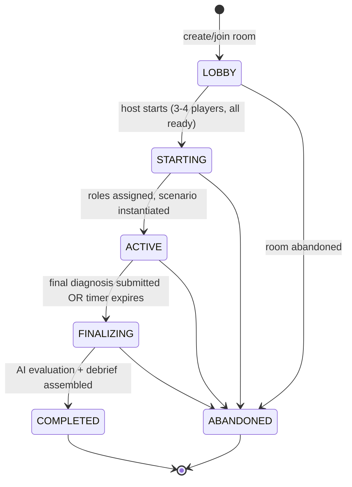

# Game Design

## Pitch

Incident-response war room × escape room × social deduction × debugging simulator. 3-4 players each
see a different slice of one production incident and have a fixed clock to combine what they know
into a correct root cause before time runs out.

## The game loop, step by step

This is `packages/game-engine/src/stateMachine.ts`'s literal transition table — every arrow above is
an entry in `LEGAL_TRANSITIONS`, and every non-arrow (e.g. `ACTIVE → LOBBY`) throws
`IllegalPhaseTransitionError` if attempted. See `docs/DECISIONS.md` for why this state machine (not
ad-hoc phase checks scattered across handlers) is the single authority.

1. Landing page → create room (get a 5-character code) or join one.
2. Lobby: players see each other join in real time, mark ready, host picks a duration
   (5 min demo / 20 min standard) and starts.
3. Server atomically assigns roles (`roomService.assignRoles` — Fisher-Yates shuffle over the role
   pool, 4 players get all four roles, 3 players get the three investigative roles and no IC) and
   instantiates the scenario for the chosen duration.
4. Each player receives a private `game:snapshot`: their role, their role's tools, and only the
   evidence their role can see that has already unlocked (nothing, at t=0).
5. Investigation: players run tools (deterministic, some time-gated — see below), evidence unlocks
   privately, players promote findings to the shared "known facts" board, propose hypotheses, and
   support/challenge each other's hypotheses. AI gives non-leaking feedback per hypothesis.
6. Deterministic timeline events reveal on a fixed schedule regardless of player action (e.g. "error
   rate crosses 5%") — this is ambient pressure/pacing, not a clue delivery mechanism.
7. Whoever is authorized (the Incident Commander if one exists, otherwise anyone) submits a final
   diagnosis: root cause, cited evidence, remediation.
8. AI grades it against the scenario's rubric; deterministic code computes efficiency and
   collaboration; a debrief is assembled and shown to everyone.

## Roles and what each one can see

| Role | Tools | Evidence categories |
|---|---|---|
| Backend Engineer | app logs, distributed traces, deployment history, endpoint stats, payment-dependency health | deployment diff, N+1 trace pattern, error logs, endpoint latency, a red-herring dependency check |
| Database Engineer | connection pool monitor, query volume stats, slow-query log, lock monitor, replication status | pool saturation graph, query volume spike, three red-herring "nothing wrong here" results |
| SRE / Infra | CPU/memory panel, pod health, request rate, network health, infra events feed | flat CPU/memory (key evidence), normal request rate (key evidence), three red herrings |
| Incident Commander | none — coordinates via chat, the shared board, and submits the final diagnosis | sees the shared timeline/known-facts/hypotheses board, never raw role-specific evidence |

No role's tool list overlaps another's, and no evidence item is visible to more than one role
(`EvidenceDefinition.visibleToRoles` is checked to be a strict partition by the automated scenario
checklist below). This is enforced at three layers, not just "the UI doesn't show it": role→tool
authorization (`isToolAuthorizedForRole`), role→evidence visibility filtering when building a
snapshot, and a runtime check on `evidence:attach`/`knownfact:add` that rejects citing an evidence id
the caller's role can't see — even if they somehow learned the id (see `docs/WEBSOCKET_PROTOCOL.md`
"never trust the socket payload" and the privacy tests in
`apps/server/src/__tests__/security.test.ts`).

## The scenario: Checkout Degradation

**Symptoms**: checkout latency rises from ~200ms to several seconds; a growing share of requests
fail with 5xx; CPU/memory stay flat; a deploy went out shortly before symptoms began.

**Ground truth**: `checkout-service v2.14.0` adds a per-cart-item loyalty-discount lookup — instead of
one batched query per cart, it issues one query *per line item* (classic N+1). `loyalty_history` query
volume jumps ~8x. The fixed 20-connection DB pool saturates. Requests queue for a connection; once the
wait exceeds the 5s acquire timeout, the request fails with a 5xx. CPU/memory stay flat because the
bottleneck is pool contention (I/O wait), not compute — which is exactly why "CPU doesn't obviously
spike" despite severe degradation.

**Key evidence** (`scenario.rootCause.keyEvidenceIds`, 7 items spanning 3 roles): the deploy log entry
and the N+1 trace pattern and the app error logs (backend); the pool-saturation graph and the
query-volume spike (database); flat CPU/memory and normal request rate (SRE, the negative evidence
that rules out "it's infra"). No single role holds enough of this to submit a *complete* diagnosis —
backend alone can spot "a deploy added a repeated lookup" but can't independently confirm the pool
actually saturated or that infra-level causes are ruled out; database alone can see the pool saturate
and the query volume spike but not *why* the volume rose or that the deploy is the trigger.

**Five red herrings**, each tied to a specific tool result that rules it out (not just "no clue given
either way" — an active, checkable dead end): a traffic spike (ruled out by SRE's flat request-rate
metric), a crash loop / memory leak (ruled out by zero pod restarts + flat memory), replication lag
(ruled out by DB's normal replica lag), lock contention (ruled out by DB's empty lock monitor), a slow
payment dependency (ruled out by backend's normal payment-provider stats).

**Time-gated evidence**: several key items (the N+1 trace, the error logs, the pool-saturation graph,
the query-volume spike, the flat-CPU reading) only appear once the simulation clock passes a fraction
of the total duration — checking a tool at t=0 shows a deliberately boring baseline. This rewards
re-checking tools as the incident evolves rather than a single "click everything once" pass, and
means the *order* and *timing* of investigation matters, not just coverage.

Durations are authored once as fractions of `durationSeconds` and scaled at scenario-build time
(`buildCheckoutDegradationScenario(durationSeconds)`) — a 60s "instant" preset (used only by the bot
script and integration tests) and the real 5min/20min presets share one causal script instead of
maintaining parallel content.

## Automated scenario-quality checklist

`packages/game-engine/src/scenarioValidation.ts`'s `evaluateScenarioQuality` mechanically checks the
structural properties good scenario design requires, and is run as a unit test
(`scenarioValidation.test.ts`) against both the standard and instant duration presets:

- rubric weights sum to exactly 100
- every `keyEvidenceIds` entry references real evidence (no dangling ids)
- key evidence spans **at least 3 roles** — the "no single role can solve it alone" property, checked
  mechanically rather than asserted in prose
- every investigative role contributes at least one piece of key evidence
- every investigative role has at least one red herring to rule out
- at least one documented plausible-but-wrong hypothesis exists
- timeline timestamps are monotonic and within `[0, durationSeconds]`
- every evidence unlock references a real tool id
- no evidence item is visible to zero roles (dead content)
- every investigative role has at least 3 evidence items (not a single clue card)

This cannot prove the scenario is *fun* — that was assessed by actually playing it via the bot
simulation and manual browser testing (see `docs/REVIEW_NOTES.md` game-design review) — but it
mechanically enforces every property that would make a scenario *broken* regardless of how well it
reads.

## Target pacing

Standard mode targets 15-25 minutes (`DURATION_PRESETS.standard = 1200s`); demo mode targets ~5
minutes for playtesting (`DURATION_PRESETS.demo = 300s`). An `instant` preset (60s) exists solely for
automated regression testing (bot script, integration tests) and is not exposed in the web UI's
duration picker — see `docs/TESTING.md`.

## Known design limitations

- The knowledge board models **Known Facts** and **Hypotheses** (with a status badge that functionally
  covers "ruled out" via `CONTRADICTED`) but does not have a separate freeform "Open Questions" list —
  that category from the original brief wasn't given its own data model since nothing else in the
  domain needed to reference an "open question" as a first-class object; teammates use chat for that.
- Tool re-execution has no cost or cooldown beyond the flat rate limiter — a very fast team could
  spam every tool once per second. This didn't come up as a problem in playtesting (the interesting
  bottleneck is understanding, not tool-call throughput) but would be worth revisiting if repeated
  tool-mashing turned out to be a viable "strategy" that undermines investigation pacing.
